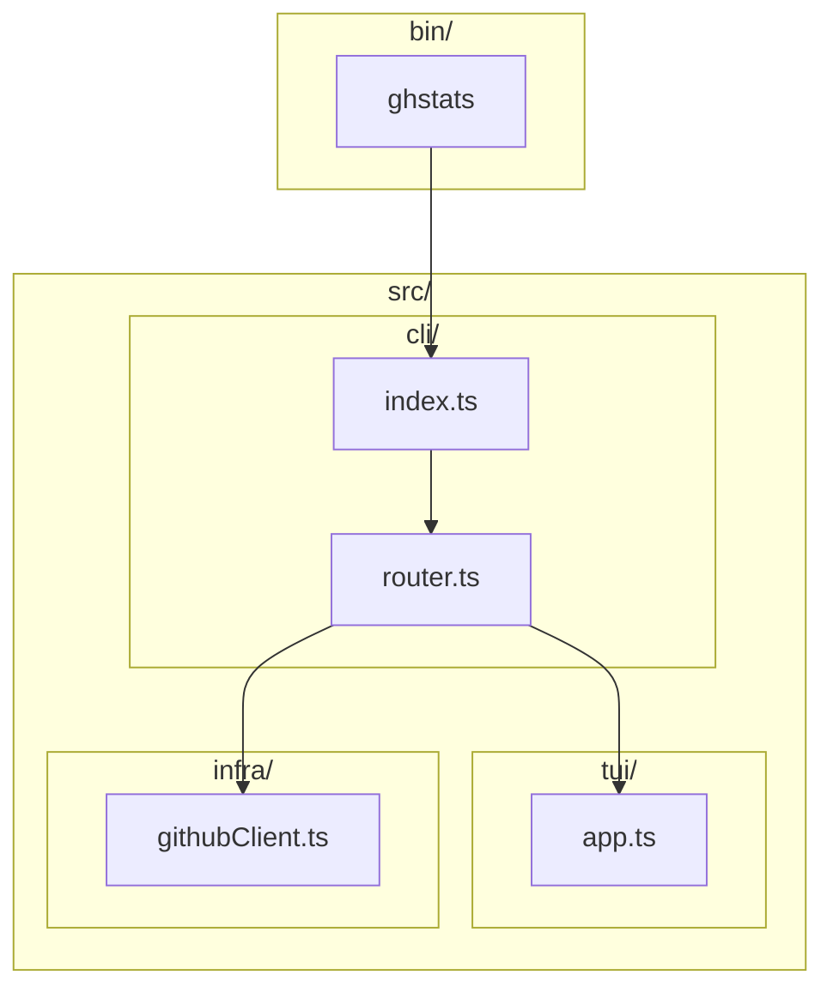

# Phase 0: Skeleton & Spike

## Overview

This phase establishes the foundational project structure, verifies OpenTUI integration works, and confirms GitHub API authentication. The goal is to have a runnable `ghstats` command that can launch either a minimal TUI or fetch the authenticated user's GitHub username.

## Prerequisites

Before starting, ensure:

- **Bun >= 1.0** is installed
- **Zig** is installed (required by OpenTUI native bindings)
- **GitHub OAuth App registered** (one-time setup, see below)

### Registering a GitHub OAuth App

1. Go to https://github.com/settings/developers
2. Click "New OAuth App"
3. Fill in:

   - **Application name:** `ghstats`
   - **Homepage URL:** `https://github.com/yourusername/ghstats` (or any URL)
   - **Authorization callback URL:** `http://localhost` (not used for Device Flow, but required)

4. Click "Register application"
5. Copy the **Client ID** - this will be stored in `src/infra/auth.ts`
6. Enable **Device Flow** in the app settings

## Architecture



## Implementation Steps

### 1. Initialize Bun Project

Create `package.json` with initial dependencies:

- `@opentui/core` - TUI framework
- `commander` - CLI argument parsing
- `@octokit/rest` - GitHub REST API client

Create `bunfig.toml` for Bun configuration.

Create `tsconfig.json` for TypeScript settings.

### 2. Create Project Directory Structure

```
src/
  cli/
    index.ts      # CLI entrypoint
    router.ts     # Command routing via commander
  tui/
    app.ts        # OpenTUI app launcher
  infra/
    githubClient.ts  # GitHub API client
  types/
    domain.ts     # Placeholder for shared types
bin/
  ghstats        # Executable wrapper
```

### 3. Implement CLI Entrypoint

[`src/cli/index.ts`](src/cli/index.ts) - Main entrypoint that initializes the CLI.

[`src/cli/router.ts`](src/cli/router.ts) - Uses `commander` to define:

- Default command (no args) -> launches TUI
- `ghstats whoami` -> spike command to test GitHub auth

### 4. Implement OpenTUI "Hello World"

[`src/tui/app.ts`](src/tui/app.ts) - Minimal OpenTUI screen displaying:

- "ghstats" title
- Current date/time
- Press 'q' to quit

This validates OpenTUI and Zig bindings work correctly.

### 5. Implement GitHub Client Spike

[`src/infra/githubClient.ts`](src/infra/githubClient.ts) - Basic client that:

- Reads token from `GITHUB_TOKEN` or `GH_TOKEN` env var
- Creates Octokit REST client instance
- Exposes `getAuthenticatedUser()` method to fetch username

### 6. Create Executable Wrapper

[`bin/ghstats`](bin/ghstats) - Shell script or Bun shebang that invokes `src/cli/index.ts`

### 7. Add Development Scripts

In `package.json`:

- `dev` - Run with hot reload
- `build` - Compile if needed
- `start` - Run the CLI

## Deliverables

After Phase 0 completion:

1. Running `bun run bin/ghstats` launches the TUI with "Hello world" screen
2. Running `bun run bin/ghstats whoami` prints the authenticated GitHub username
3. Project structure matches the proposed architecture from the PRD

## Notes

- The PRD mentions OpenTUI uses an imperative API from `@opentui/core`
- Token is read from environment only (no config file storage in Phase 0)
- No caching implemented in this phase